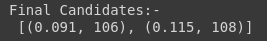
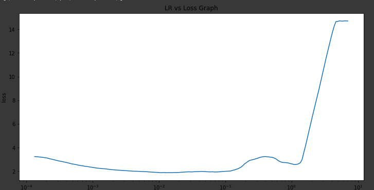
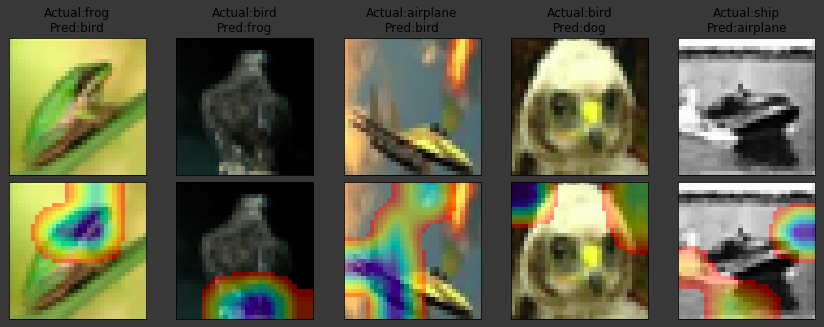

# LR-FInder

This repository has the implementation of LR finder to find the best Starting LR for the developed model. 
Concepts Used:
1. SGD with momentum.
2. Test and Training Curve.
3. Gradcam of misclassified Images.
4. LR finder to find best starting LR.

### LR Finders LR List

The program generated 2 LRs

### LR finder Curve

The below grah represents the LR and loss obtained.

#### Hightest Accuracy of the model: 88.77%

### Misclassified Images

The above image shows 5 misclassied images, we can interpret that the predicted outputs were incorrecct because there gave results by either partially looking at the object or by looking at the backkground. Hence the system is needed to be trained over such images to increase the accuracy.
