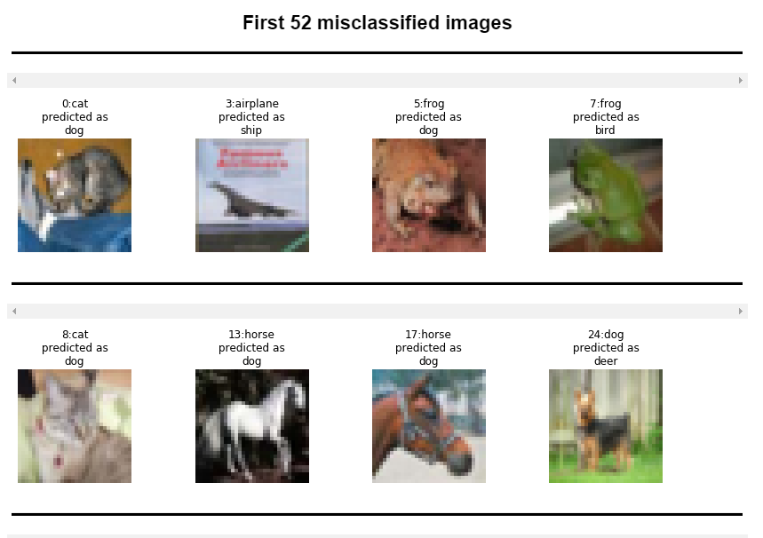

# ShuffleNets

Implemented ShuffleNets in Tensorflow 2.0 which is by default in Eager Mode. 
Used the created [API](https://github.com/prateekgulati/rgApi) to convert to TFRecords, Cutouts and Missclassified Images. 

Here the there was no Target Accuracy, Hence just trained the model for 5 epochs and plotted misclassified images.

### Misclassified Images:

Some of the misclassified Images are:- 

