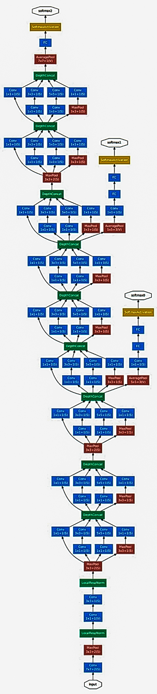

# GoogleNet
Calculating receptive field of Google Net

### GoogleNet

Input Size  = 224x224x3

|Input Layer | Input | Strides | Output (n out) | Receptive Field (r out) | J in | J out | Remarks |
| --- | --- | --- | --- | --- | --- | --- | --- |
| Convolution | 7x7 | 2 | 112 | 7 | 1 | 2 | Assymtrical Padding |
| Max Pool | 3x3 | 2 | 56 | 11 | 2 | 4 |
| Convolution | 1x1 | 1 | 56 | 11 | 4 | 4 | Pointwise convolution |
| Convolution | 3x3 | 1 | 56 |  19 | 4 | 4 | Padding |
| Max Pool | 3x3 | 2 | 28 | 27 | 4 | 8 |
| Inception (3a) |  
| 1 | 1x1 | 1 | 28 | 27 | 8 | 8 |
| 2a | 1x1 | 1 | 28 | 27 | 8 | 8 |
| 2b | 3x3 | 1 | 28 | 43 | 8 | 8 | Padding = 1 |
| 3a | 1x1 | 1 | 28 | 27 | 8 | 8 |
| 3b | 5x5 | 1 | 28 | 59 | 8 | 8 | Padding  = 2 |
| 4a | 3x3 Max Pool | 1 | 28 | 43 | 8 | 8 | Padding = 1 |
| 4b | 1x1 | 1 | 28 | 43 | 8 | 8 |
| Inception (3b) |
| 1 | 1x1 | 1 | 28 | 59 | 8 | 8 |
| 2a | 1x1 | 1 | 28 | 59 | 8 | 8 |
| 2b | 3x3 | 1 | 28 | 75 | 8 | 8 | Padding = 1 |
| 3a | 1x1 | 1 | 28 | 59 | 8 | 8 |
| 3b | 5x5 | 1 | 28 | 91 | 8 | 8 | Padding  = 2 |
| 4a | 3x3 Max Pool | 1 | 28 | 75 | 8 | 8 | Padding = 1 |
| 4b | 1x1 | 1 | 28 | 75 | 8 | 8 |
| Max Pool | 3x3 | 2 | 14 | 107 | 8 | 16 | Asym Padding |
| Inception (4a) |  
| 1 | 1x1 | 1 | 14 | 107 | 16 | 16 |
| 2a | 1x1 | 1 | 14 | 107 | 16 | 16 |
| 2b | 3x3 | 1 | 14 | 139 | 16 | 16 | Padding = 1 |
| 3a | 1x1 | 1 | 14 | 107 | 16 | 16 |
| 3b | 5x5 | 1 | 14 | 171 | 16 | 16 | Padding  = 2 |
| 4a | 3x3 Max Pool | 1 | 14 | 139 | 16 | 16 | Padding = 1 |
| 4b | 1x1 | 1 | 14 | 139 | 16 | 16 |
| Inception (4b) |
| 1 | 1x1 | 1 | 14 | 171 | 16 | 16 |
| 2a | 1x1 | 1 | 14 | 171 | 16 | 16 |
| 2b | 3x3 | 1 | 14 | 203 | 16 | 16 | Padding = 1 |
| 3a | 1x1 | 1 | 14 | 171 | 16 | 16 |
| 3b | 5x5 | 1 | 14 | 235 | 16 | 16 | Padding  = 2 |
| 4a | 3x3 Max Pool | 1 | 14 | 203 | 16 | 16 | Padding = 1 |
| 4b | 1x1 | 1 | 14 | 203 | 16 | 16 |
| 5a | 5x5 Average Pool | 1 | 14 | 235 | 16 | 16 |
| 5b | 1x1 | 1 | 14 | 235 | 16 | 16 |
| 5c | FC | 1 | 14 | 235 | 16 | 16 |
| 5d | FC | 1 | 14 | 235 | 16 | 16 |
| 5e | Softmax | 1 | 14 | 235 | 16 | 16 |
| Inception (4c) | 
| 1 | 1x1 | 1 | 14 | 235 | 16 | 16 |
| 2a | 1x1 | 1 | 14 | 235 | 16 | 16 |
| 2b | 3x3 | 1 | 14 | 253  | 16 | 16 | Padding = 1 |
| 3a | 1x1 | 1 | 14 | 235 | 16 | 16 |
| 3b | 5x5 | 1 | 14 | 299 | 16 | 16 | Padding  = 2 |
| 4a | 3x3 Max Pool | 1 | 14 | 253 | 16 | 16 | Padding = 1 |
| 4b | 1x1 | 1 | 14 |253| 16 | 16 |
| Inception (4d) |
| 1 | 1x1 | 1 | 14 | 299 | 16 | 16 |
| 2a | 1x1 | 1 | 14 | 299 | 16 | 16 |
| 2b | 3x3 | 1 | 14 | 331  | 16 | 16 | Padding = 1 |
| 3a | 1x1 | 1 | 14 | 299 | 16 | 16 |
| 3b | 5x5 | 1 | 14 | 363 | 16 | 16 | Padding  = 2 |
| 4a | 3x3 Max Pool | 1 | 14 | 331 | 16 | 16 | Padding = 1 |
| 4b | 1x1 | 1 | 14 | 331 | 16 | 16 |
| Inception (4e) |
| 1 | 1x1 | 1 | 14 | 363 | 16 | 16 |
| 2a | 1x1 | 1 | 14 | 363 | 16 | 16 |
| 2b | 3x3 | 1 | 14 | 395  | 16 | 16 | Padding = 1 |
| 3a | 1x1 | 1 | 14 | 363 | 16 | 16 |
| 3b | 5x5 | 1 | 14 | 427 | 16 | 16 | Padding  = 2 |
| 4a | 3x3 Max Pool | 1 | 14 | 395 | 16 | 16 | Padding = 1 |
| 4b | 1x1 | 1 | 14 | 395 | 16 | 16 |
| 5a | 5x5 Average Pool | 1 | 14 | 427 | 16 | 16 |
| 5b | 1x1 | 1 | 14 | 427 | 16 | 16 |
| 5c | FC | 1 | 14 | 427 | 16 | 16 |
| 5d | FC | 1 | 14 | 427 | 16 | 16 |
| 5e | Softmax | 1 | 14 | 427 | 16 | 16 |
| Max Pool | 3x3 | 2 | 7 | 459 | 16 | 32 | Asym Padding |
| Inception (5a) |
| 1 | 1x1 | 1 | 7 | 459 | 32 | 32 |
| 2a | 1x1 | 1 | 7 | 459 | 32 | 32 |
| 2b | 3x3 | 1 | 7 | 523  | 32 | 32 | Padding = 1 |
| 3a | 1x1 | 1 | 7 | 459 | 32 | 32 |
| 3b | 5x5 | 1 | 7 | 587 | 32 | 32 | Padding  = 2 |
| 4a | 3x3 Max Pool | 1 | 7 | 523 | 32 | 32 | Padding = 1 |
| 4b | 1x1 | 1 | 7 | 523 | 32 | 32 |
| Inception (5b)|
| 1 | 1x1 | 1 | 7 | 587 | 32 | 32 |
| 2a | 1x1 | 1 | 7 | 587 | 32 | 32 |
| 2b | 3x3 | 1 | 7 |  651 | 32 | 32 | Padding = 1 |
| 3a | 1x1 | 1 | 7 | 587 | 32 | 32 |
| 3b | 5x5 | 1 | 7 | 715 | 32 | 32 | Padding  = 2 |
| 4a | 3x3 Max Pool | 1 | 7 | 651 | 32 | 32 | Padding = 1 |
| 4b | 1x1 | 1 | 7 | 651 | 32 | 32 |
| Avg Pool | 7x7 | 1 | 1 | 907 | 32 | 32 |
| Dropout | 7x7 | 1 | 1 | 907 | 32 | 32 |
| Softmax | 7x7 | 1 | 1 | 907 | 32 | 32 |

#### Receptive fields Obtained are:- 907,427 & 235
