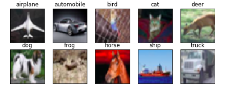
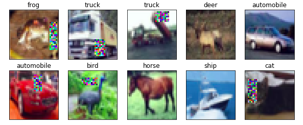
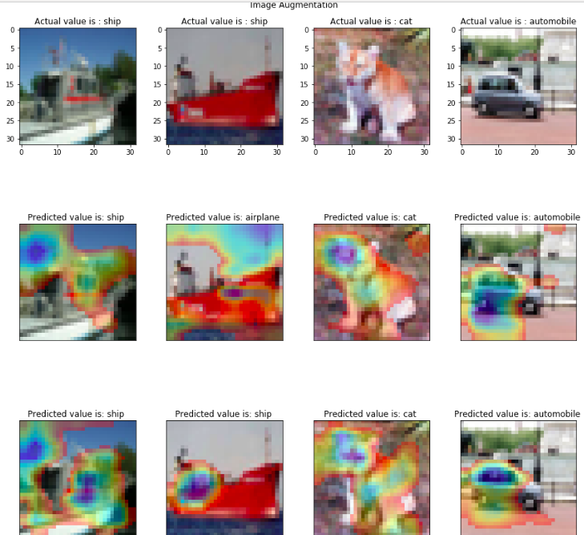

# EVA---Session-9-Cutouts-GradCAM

Cutout is an Image Augmentation Technique in which some portion of the image is replaced with the mean of all values and the network is forced to look to other features to classify object

This image shows the dataset without any augmentation stratergy applied.

The above figure represents cutout being added to the dataset. Hence as the cutout percentage is 50%, therefore not all images have some portion missing. 

When the model is trained over dataset having no cutout and having cutouts, it is observed that there is an increase in accuracy when the model is trained with cutouts as the network now looks at other features to classify thus forcing to learn new things in the same timeframe. 

#### Accuracy Achieved without Cutout:84.06%

#### Accuracy Acheived With Cutout: 87.44%

This image shows the difference of using cutouts, we can see that when used gradcam(basically a heatmap over features which are firing for that class), the images with cutout form over the object where as images without cutout predict classes with backgrround pixels also as an input. 
