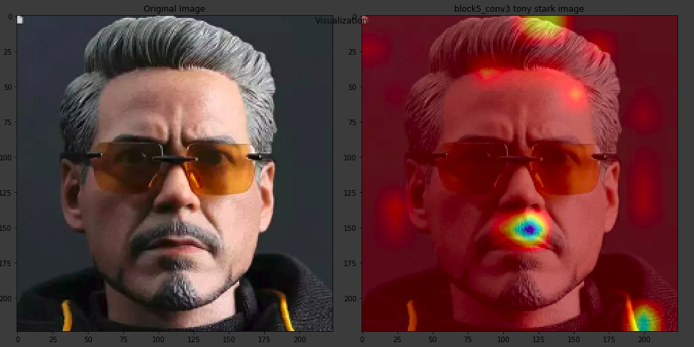

# EVA---Session-10-VGG
This repository consists of interpreting the outputs VGG model with GRADcam

GradCam Output for Layer:- Original, block5_conv3, block5_conv2 and block5_conv1

GradCam Output for Tony Stark image for class number 835,836 and 837.

Therefore class 836 and 837 exactly fit at the glasses. 

This shows which kernel fires for what part of the image
