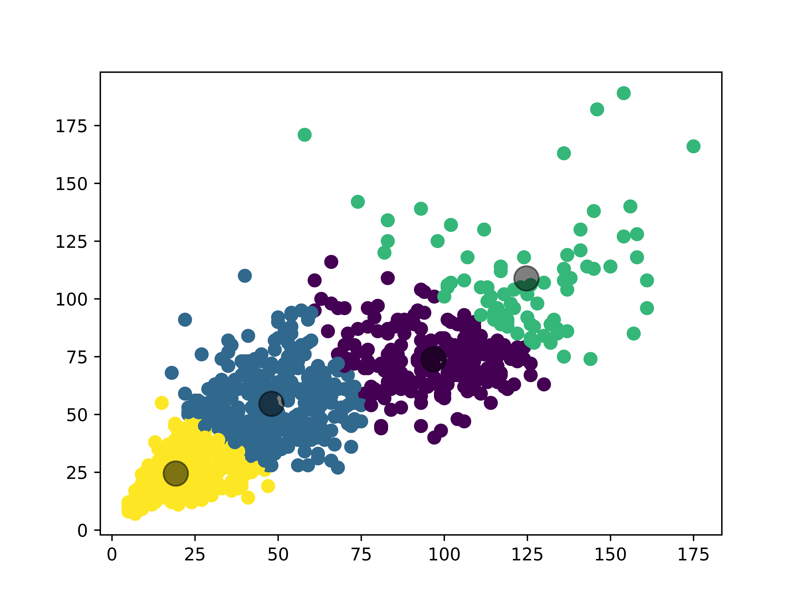
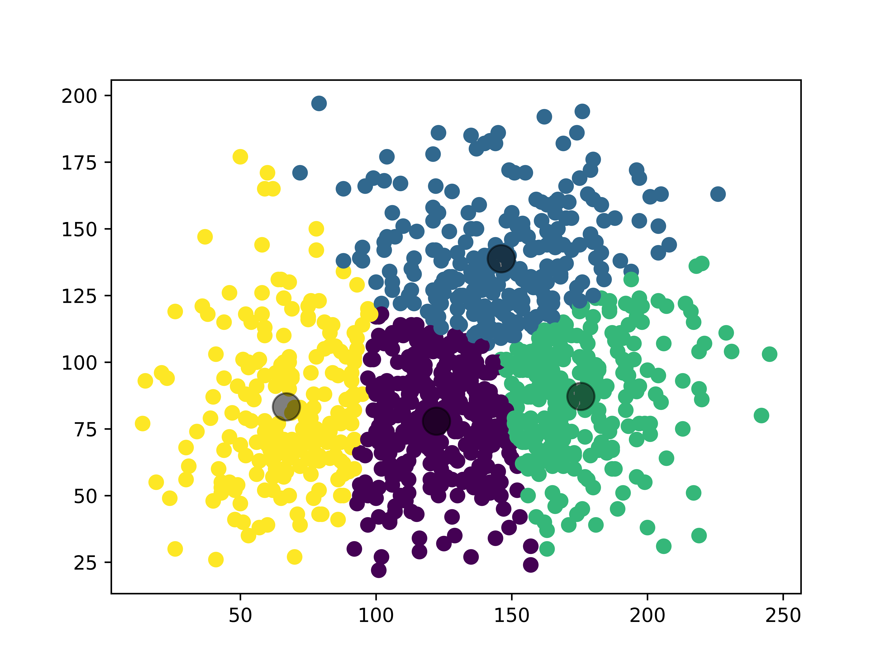

# Data Annotation

Created a labelled Face Dataset using [VGG Annotator](http://www.robots.ox.ac.uk/~vgg/software/via/). 
The dataset contains the images of people looking in some direction which is Up, Down,Left,Right,Top, Back, UpRight, UpLeft, DownRight and DownLeft.

After Labelling, the centroid of bounding box with and without location is extracted and 4 potencial Anchor Boxes are generated using KMeans Algorithm.

rename_resize.py is the script to rename and resize the images to 400 x 400.

kmeans_with_location.py is used to find the potencial anchor boxes. 

Here, I have calculated k means wth and and without including initial location.

Here the four potencial bounding boxes are decided based just over the size of the box

Here the four potencial bounding boxes are decided based over the size of the box and location of the boxes.

[Link to Dataset](https://drive.google.com/drive/folders/1IXQHnZ2I55tlWahcsfY4gIIoJtUcXN3t)