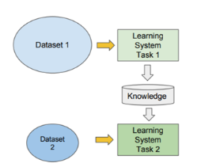

# Tranfer Learning

Transfer Learning is a type of learning where learning a new task relies on previous task.

I worked over Resnet 18 Model trained over Imagenet Dataset. I loaded the model and retrained the last few layers of it. 

## Results

Training the Whole Model

