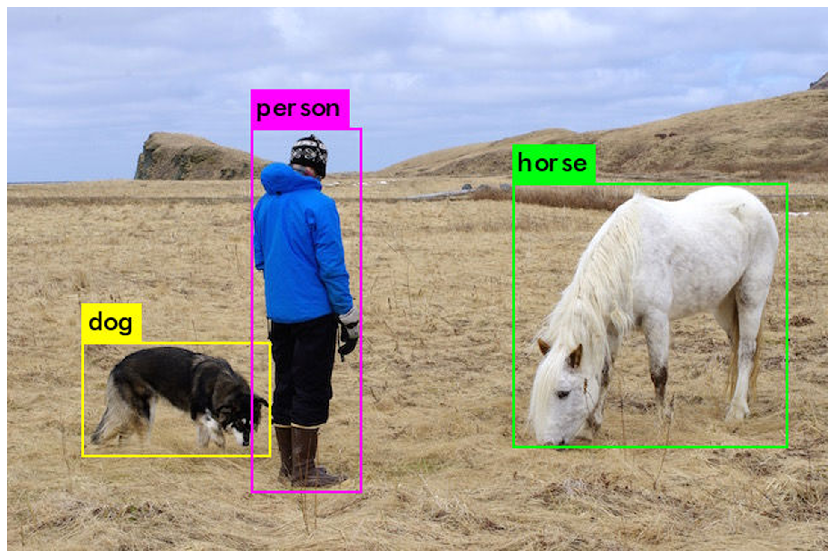

# Tranfer Learning

Transfer Learning is a type of learning where learning a new task relies on previous task.

I worked over a pretrained YOLO Model and trained it over my dataset to detect football in real time. 

## Results

### Pretrained Model result

Importing pretrained Model

### New Model Results

New Model Result

### Other Results

[Link to my Youtube](https://youtu.be/DY5EdGvKP2Q)

